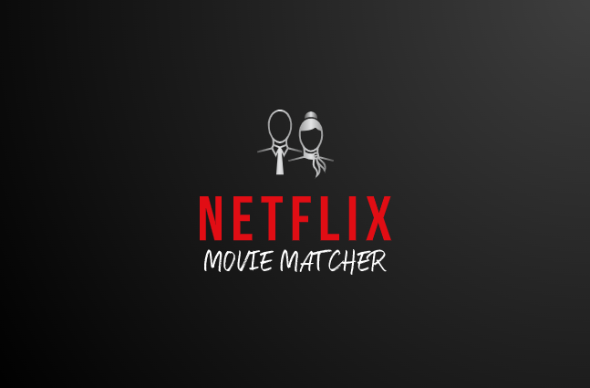

    
    
    
    

<!-- <h1 align="center">Netflix Movie Matcher</h1> -->
<h2 align="center"><a href="https://netflixmoviematcher.herokuapp.com/">** Click Here to Demo **</a></h2>

## Description

Think of this as **a hybrid of Netflix and Tinder**.

Do you and your partner waste a lot of time looking for a show to watch together?

Netflix Movie Matcher is the solution that gives you back your time.

**Users can:**
:white_check_mark: - Create their own accounts
:movie_camera: - Watch Netflix show/movie trailers
:+1: - Add/remove trailers from their personal Favorites list
:mag_right: - Search for other users
:couple: - Follow/unfollow other users (Twitter-style relationship)
:tv: - Compare favorites with other users

## Demo

If you'd like to [visit the site](https://netflixmoviematcher.herokuapp.com/), I made you an account already :)

<i>(but you're welcome to make your own!)</i>

**Username:** `netflixDemo@dev.com`
**Password:** `TopSecret`

:exclamation: Feel free to use `ben@dev.com` as another profile to search for.

<h3 align="center">Otherwise, keep scroling down for a detailed site preview...</h3>

    

4) Have image of Home page, Movie Theatre Mode, Compare mode

## Technologies
- ReactJS
- CSS (no frameworks)
- [React Router](https://reactrouter.com/en/v6.3.0/getting-started/overview)
- [React Youtube](https://www.npmjs.com/package/react-youtube)
- Heroku (for deployment)
- [Backend GitHub can be found here](LINK)
 -Ruby
 -PostgreSQL
## Use
If you clone this repo, you can run it locally using `npm start`